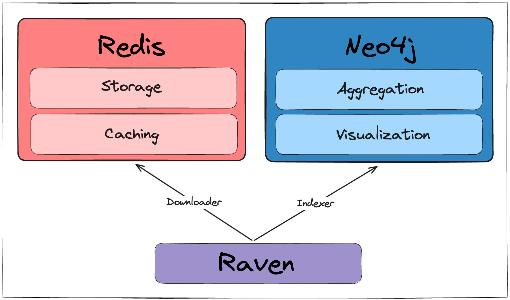

# Raven - CI/CD Security Analyzer
[](https://opensource.org/licenses/MIT)


**RAVEN (Risk Analysis and Vulnerability Enumeration for CI/CD)** is a powerful security tool designed to perform massive scans for GitHub Actions CI workflows and digest the discovered data into a Neo4j database.
<br><br><br>
<p align="center">

</p>
<br><br>


With Raven, we were able to identify and report security vulnerabilities in some of the most popular repositories hosted on GitHub, including:

- [FreeCodeCamp](https://github.com/freeCodeCamp/freeCodeCamp) (the most popular project on GitHub)
- [Storybook](https://github.com/storybookjs/storybook) (One of the most popular frontend frameworks)
- [Fluent UI](https://github.com/microsoft/fluentui) by Microsoft
- and much more

We listed all vulnerabilities discovered using Raven in the tool [Hall of Fame](#hall-of-fame---vulnerabilities-found-and-disclosed-using-raven).

## What is Raven

The tool provides the following capabilities to scan and analyze potential CI/CD vulnerabilities:

- ⏬ **Downloader:** You can download workflows and actions necessary for analysis. Workflows can be downloaded for a specified organization or for all repositories, sorted by star count. Performing this step is a prerequisite for analyzing the workflows.
- 📊 **Indexer:** Digesting the downloaded data into a graph-based Neo4j database. This process involves establishing relationships between workflows, actions, jobs, steps, etc.
- 📚 **Query Library:** We created a library of pre-defined queries based on research conducted by the community.
- ❗ **Report:** Raven has a simple way of reporting suspicious findings. As an example, it can be incorporated into the CI process for pull requests and run there.

Possible usages for Raven:

- Scanner for your own organization's security
- Scanning specified organizations for bug bounty purposes
- Scan everything and report issues found to save the internet
- Research and learning purposes

This tool provides a reliable and scalable solution for CI/CD security analysis, enabling users to query bad configurations and gain valuable insights into their codebase's security posture.

## Why Raven

In the past year, Cycode Labs conducted extensive research on fundamental security issues of CI/CD systems. We examined the depths of many systems, thousands of projects, and several configurations. The conclusion is clear – the model in which security is delegated to developers has failed. This has been proven several times in our previous content:

- A simple injection scenario exposed dozens of public repositories, including popular open-source projects.
- We found that one of the most popular frontend frameworks was vulnerable to the innovative method of branch injection attack.
- We detailed a completely different attack vector, 3rd party integration risks, the most popular project on GitHub, and thousands more.
- Finally, the Microsoft 365 UI framework, with more than 300 million users, is vulnerable to an additional new threat – an artifact poisoning attack.
- Additionally, we found, reported, and disclosed hundreds of other vulnerabilities privately.

Each of the vulnerabilities above has unique characteristics, making it nearly impossible for developers to stay up to date with the latest security trends. Unfortunately, each vulnerability shares a commonality – each exploitation can impact millions of victims.

It was for these reasons that Raven was created, a framework for CI/CD security analysis workflows (and GitHub Actions as the first use case). In our focus, we examined complex scenarios where each issue isn't a threat on its own, but when combined, they pose a severe threat.

## Setup && Run

To get started with Raven, follow these installation instructions:

**Step 1**: Download the latest stable version, The install script requires `curl`, `wget` and `jq`
``` bash
curl -sSfL https://raw.githubusercontent.com/CycodeLabs/raven/f020094d175ab5cd0eb10442c6f7728485cc6903/install.sh | bash
cd raven
```

or, you can download the latest release from `https://github.com/CycodeLabs/raven/releases/latest`

**Step 2**: Create a virtual environment
``` bash
python3 -m venv .venv
source .venv/bin/activate
```

**Step 3**: Build a containerized environment and install Raven
```bash
sudo make setup
```

**Step 4**: Run Raven
``` bash
raven
```

### Prerequisites

- Python 3.9+
- Docker Compose v2.1.0+
- Docker Engine v1.13.0+

## Infrastructure
Raven is using two primary docker containers: Redis and Neo4j. 
`make setup` will run a `docker-compose` command to prepare that environment.




## Usage

The tool contains two main functionalities, `download` and `index`.

### Download


#### Download Organization Repositories

```bash
usage: raven download org [-h] --token TOKEN [--debug] [--redis-host REDIS_HOST] [--redis-port REDIS_PORT] [--clean-redis] --org-name ORG_NAME

options:
  -h, --help            show this help message and exit
  --token TOKEN         GITHUB_TOKEN to download data from Github API (Needed for effective rate-limiting)
  --debug               Whether to print debug statements, default: False
  --redis-host REDIS_HOST
                        Redis host, default: localhost
  --redis-port REDIS_PORT
                        Redis port, default: 6379
  --clean-redis, -cr    Whether to clean cache in the redis, default: False
  --org-name ORG_NAME   Organization name to download the workflows
```

#### Download Public Repositories
``` bash
usage: raven download crawl [-h] --token TOKEN [--debug] [--redis-host REDIS_HOST] [--redis-port REDIS_PORT] [--clean-redis] [--max-stars MAX_STARS] [--min-stars MIN_STARS]

options:
  -h, --help            show this help message and exit
  --token TOKEN         GITHUB_TOKEN to download data from Github API (Needed for effective rate-limiting)
  --debug               Whether to print debug statements, default: False
  --redis-host REDIS_HOST
                        Redis host, default: localhost
  --redis-port REDIS_PORT
                        Redis port, default: 6379
  --clean-redis, -cr    Whether to clean cache in the redis, default: False
  --max-stars MAX_STARS
                        Maximum number of stars for a repository
  --min-stars MIN_STARS
                        Minimum number of stars for a repository, default: 1000
```

### Index

```bash
usage: raven index [-h] [--redis-host REDIS_HOST] [--redis-port REDIS_PORT] [--clean-redis] [--neo4j-uri NEO4J_URI] [--neo4j-user NEO4J_USER] [--neo4j-pass NEO4J_PASS]
                   [--clean-neo4j] [--debug]

options:
  -h, --help            show this help message and exit
  --redis-host REDIS_HOST
                        Redis host, default: localhost
  --redis-port REDIS_PORT
                        Redis port, default: 6379
  --clean-redis, -cr    Whether to clean cache in the redis, default: False
  --neo4j-uri NEO4J_URI
                        Neo4j URI endpoint, default: neo4j://localhost:7687
  --neo4j-user NEO4J_USER
                        Neo4j username, default: neo4j
  --neo4j-pass NEO4J_PASS
                        Neo4j password, default: 123456789
  --clean-neo4j, -cn    Whether to clean cache, and index from scratch, default: False
  --debug               Whether to print debug statements, default: False
```

### Report - beta version
<details>
  <summary>expand</summary>
    
```bash
usage: raven report [-h] [--redis-host REDIS_HOST] [--redis-port REDIS_PORT] [--clean-redis] [--neo4j-uri NEO4J_URI] [--neo4j-user NEO4J_USER] [--neo4j-pass NEO4J_PASS]
                    [--clean-neo4j] [--tag TAG] [--severity SEVERITY] [--detections-path DETECTIONS_PATH]
                    {slack} ...

positional arguments:
  {slack}
    slack               Send report to slack channel

options:
  -h, --help            show this help message and exit
  --redis-host REDIS_HOST
                        Redis host, default: localhost
  --redis-port REDIS_PORT
                        Redis port, default: 6379
  --clean-redis, -cr    Whether to clean cache in the redis, default: False
  --neo4j-uri NEO4J_URI
                        Neo4j URI endpoint, default: neo4j://localhost:7687
  --neo4j-user NEO4J_USER
                        Neo4j username, default: neo4j
  --neo4j-pass NEO4J_PASS
                        Neo4j password, default: 123456789
  --clean-neo4j, -cn    Whether to clean cache, and index from scratch, default: False
  --tag TAG, -t TAG     Filter detections with spesific tag
  --severity SEVERITY, -s SEVERITY
                        Filter detections with spesific severity
  --detections-path DETECTIONS_PATH, -dp DETECTIONS_PATH
                        Detections folder (default: library)
```

  
</details>


## Examples

Retrieve all workflows and actions associated with the organization.
``` bash
raven download org --token $GITHUB_TOKEN --org-name microsoft --org-name google --debug
```

Scrape all publicly accessible GitHub repositories.
``` bash
raven download crawl --token $GITHUB_TOKEN --min-stars 100 --max-stars 1000 --debug
```

After finishing the download process or if interrupted using Ctrl+C, proceed to index all workflows and actions into the Neo4j database.

``` bash
raven index --debug
```

## Rate Limiting

For effective rate limiting, you should supply a Github token.
For authenticated users, the next rate limiting applies:

- Code search - 30 queries per minute
- Any other API - 5000 per hour

## Functionalities

### Downloader

- If the workflow contains an action, the downloader will also download it.
- If the workflow references a reusable workflow, the downloader will also download it.

### Indexer

- If the indexer finds workflow uses an action, it will create a proper connection to it in the graph
- Same applies to reusable workflows
- Same applies to workflow triggered through `workflow_call`

## Knowledge Base

- [Issue Injections](/docs/issue_injections/README.md)
- [Pull Request Injections](/docs/pull_request_injections/README.md)
- [Workflow Run Injections](/docs/workflow_run_injections/README.md)
- [CodeSee Injections](/docs/codesee_injections/README.md)

## Current Limitations

- It is possible to run external action by referencing a folder with a `Dockerfile` (without `action.yml`). Currently, this behavior isn't supported.
- It is possible to run external action by referencing a docker container through the `docker://...` URL. Currently, this behavior isn't supported.
- It is possible to run an action by referencing it locally. This creates complex behavior, as it may come from a different repository that was checked out previously. The current behavior is trying to find it in the existing repository.
- We aren't modeling the entire workflow structure. If additional fields are needed, please submit a pull request according to the [contribution](#contribution) guidelines.

## Future Research Work

- Implementation of taint analysis. Example use case - a user can pass a pull request title (which is controllable parameter) to an action parameter that is named `data`. That action parameter may be used in a run command: `- run: echo ${{ inputs.data }}`, which creates a path for a code execution.
- Expand the research for findings of harmful misuse of `GITHUB_ENV`. This may utilize the previous taint analysis as well.
- Research whether `actions/github-script` has an interesting threat landscape. If it is, it can be modeled in the graph.

## Contributing

We encourage contributions from the community to help improve our tooling and research. We manage contributions primarily through GitHub Issues and Pull Requests.

If you have a feature request, bug report, or any improvement suggestions, please create an issue to discuss it. To start contributing, you may check [good first issue](https://github.com/CycodeLabs/Raven/issues?q=is%3Aissue+is%3Aopen+label%3A%22good+first+issue%22) label to get started quickly into the code base.

To contribute code changes, fork our repository, make your modifications, and then submit a pull request.

Feel free to reach out to the development team through research@cycode.com. We appreciate your collaboration and look forward to your valuable contributions!

## License

[Apache License 2.0](./LICENSE.md)

## Hall of Fame - Vulnerabilities Found and Disclosed Using Raven

| Name                                                                                            | Stars                                                                         | Fix                                                                                                                             | Additional Sources                                                                                           |
| ----------------------------------------------------------------------------------------------- | ----------------------------------------------------------------------------- | ------------------------------------------------------------------------------------------------------------------------------- | ------------------------------------------------------------------------------------------------------------ |
| [freeCodeCamp/freeCodeCamp](https://github.com/freeCodeCamp/freeCodeCamp)                       |             | CodeSee package update, [0871341](https://github.com/freeCodeCamp/freeCodeCamp/commit/0871341c9cbf96ab455bc3e0bce636e2ef2a2be2) | [Blog](https://cycode.com/blog/cycode-secures-thousands-of-open-source-projects/)                            |
| [storybookjs/storybook](https://github.com/storybookjs/storybook)                               |                 | [ffb8558](https://github.com/storybookjs/storybook/commit/ffb8558b7e5df4644299e5ec7009ade6ca1a721c)                             | [Blog](https://cycode.com/ci-story-how-we-found-critical-vulnerabilities-in-storybook-project/)              |
| [tiangolo/fastapi](https://github.com/tiangolo/fastapi)                                         |                      | [9efab1b](https://github.com/tiangolo/fastapi/commit/9efab1bd96ef061edf1753626573a0a2be1eef09)                                  | [LinkedIn](https://www.linkedin.com/feed/update/urn:li:activity:7011753940283203584/)                        |
| [withastro/astro](https://github.com/withastro/astro)                                           |                       | [650fb1a](https://github.com/withastro/astro/commit/650fb1aa51a1c843c10bc89a11732b45a6345b00)                                   | [Blog](https://cycode.com/github-actions-vulnerabilities/)                                                   |
| [statelyai/xstate](https://github.com/statelyai/xstate)                                         |                      | CodeSee package update                                                                                                          | [Blog](https://cycode.com/blog/cycode-secures-thousands-of-open-source-projects/)                            |
| [docker-slim/docker-slim](https://github.com/docker-slim/docker-slim)                           |               | CodeSee package update                                                                                                          | [Blog](https://cycode.com/blog/cycode-secures-thousands-of-open-source-projects/)                            |
| [microsoft/fluentui](https://github.com/microsoft/fluentui)                                     |                    | [2ea6195](https://github.com/microsoft/fluentui/commit/2ea6195152131766641311ee5604e746b578d8e7)                                | [Blog](https://cycode.com/blog/analyzing-the-vulnerability-that-could-have-compromised-microsoft-365-users/) |
| [tiangolo/sqlmodel](https://github.com/tiangolo/sqlmodel)                                       |                     | [cf36b2d](https://github.com/tiangolo/sqlmodel/commit/cf36b2d9baccf527bc61071850f102e2cd8bf6bf)                                 | [LinkedIn](https://www.linkedin.com/feed/update/urn:li:activity:7011753940283203584/)                        |
| [tiangolo/typer](https://github.com/tiangolo/typer)                                             |                        | [0c106a1](https://github.com/tiangolo/typer/commit/0c106a169e5e3c7df6f98e32a6d8405c985b695a)                                    | [LinkedIn](https://www.linkedin.com/feed/update/urn:li:activity:7011753940283203584/)                        |
| [autogluon/autogluon](https://github.com/autogluon/autogluon)                                   |                   | [ca18fa9](https://github.com/autogluon/autogluon/commit/ca18fa9fa2071f670125fd19700cf3570a6b5119)                               |                                                                                                              |
| [liquibase/liquibase](https://github.com/liquibase/liquibase)                                   |                   | [3278525](https://github.com/liquibase/liquibase/commit/3278525eaf974daea20808926f9a6816aecd01a7)                               | [Blog](https://cycode.com/github-actions-vulnerabilities/)                                                   |
| [ossf/scorecard](https://github.com/ossf/scorecard)                                             |                        | [c9f582b](https://github.com/ossf/scorecard/commit/c9f582b620a57a1a476f4e3add505ff50c51a774)                                    |                                                                                                              |
| [Ombi-app/Ombi](https://github.com/Ombi-app/Ombi)                                               |                         | [5cc0d77](https://github.com/Ombi-app/Ombi/commit/5cc0d7727d72fe1fee8a3f6c3874d44a5b785de4)                                     | [Blog](https://cycode.com/github-actions-vulnerabilities/)                                                   |
| [wireapp/wire-ios](https://github.com/wireapp/wire-ios)                                         |                      | [9d39d6c](https://github.com/wireapp/wire-ios/commit/9d39d6c93b5a58a0bc8c1aba10e0d67756359630)                                  | [Blog](https://cycode.com/github-actions-vulnerabilities/)                                                   |
| [cloudscape-design/components](https://github.com/cloudscape-design/components)                 |          | [2921d2d](https://github.com/cloudscape-design/.github/commit/2921d2d1420fef5b849d5aecbcfb9138ac6b9dcc)                         |                                                                                                              |
| [DynamoDS/Dynamo](https://github.com/DynamoDS/Dynamo)                                           |                       | Disabled workflow                                                                                                               | [Blog](https://cycode.com/github-actions-vulnerabilities/)                                                   |
| [fauna/faunadb-js](https://github.com/fauna/faunadb-js)                                         |                      | [ee6f53f](https://github.com/fauna/faunadb-js/commit/ee6f53f9c985bde41976743530e3846dee058587)                                  | [Blog](https://cycode.com/github-actions-vulnerabilities/)                                                   |
| [apache/incubator-kie-kogito-runtimes](https://github.com/apache/incubator-kie-kogito-runtimes) |  | [53c18e5](https://github.com/apache/incubator-kie-kogito-runtimes/commit/53c18e5372e5306e0aa580f201f820b80359ad11)              | [Blog](https://cycode.com/github-actions-vulnerabilities/)                                                   |


