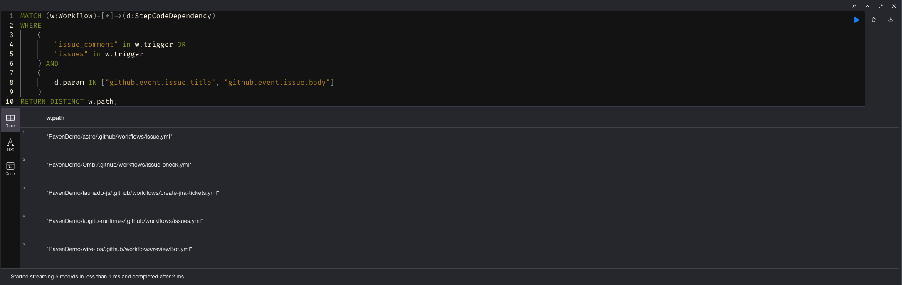

# Issues Injections


## Overview
GitHub Actions can be initiated based on an issue event. The workflow can access and utilize the information present in the issue's title or body, including printing it or performing other actions within the workflow. However, it's important to be aware that malicious actors might attempt to exploit this functionality by inserting harmful payloads into the issue's title or body. This could potentially lead to the execution of malicious code within the workflow.


## Description
This issue arises when GitHub Actions workflows, triggered by issue events, process the issue details, such as the title or body, without proper input validation or sanitization.

Let’s take the following workflow as an example:
``` cypher
name: Issues Injections

on:
  issues:
    types: [opened]

jobs:
  print_issue_title:
    runs-on: ubuntu-latest

    name: Print issue title
    steps:
    - run: echo "${{github.event.issue.title}}"
```

Threat actors can exploit this by injecting malicious payloads into the issue title. By injecting malicious code to the workflow, an attacker can exfiltrate the pipeline secrets or, with the proper permissions, use the `GITHUB_TOKEN` environment variable to push new code to the repository.

## Remediation
* Avoid directly executing or interpreting user-supplied data as code or command arguments.
* Always load user input to environment variables first.

## References
- [Cycode Discovers Vulnerabilities in CI/CD Pipelines of Popular Open-Source Projects](https://cycode.com/blog/github-actions-vulnerabilities/)

## Real-World Example


### fauna/faunadb-js - 694 ⭐️
* **Description**: This workflow runs when an issue is being opened. Lines 26 and 27 use the issue body and title at `create-jira-tickets.yml`.
* **Fix Commit Link**: [ee6f53f9c985bde41976743530e3846dee058587](https://github.com/fauna/faunadb-js/commit/ee6f53f9c985bde41976743530e3846dee058587)
* **Remediation**: Removed the workflow.

### wireapp/wire-ios - 3.2K ⭐️
* **Description**: This workflow runs when an issue is being opened. Line 15 use the issue title at `issue.yml`.
* **Fix Commit Link**: [650fb1aa51a1c843c10bc89a11732b45a6345b00](https://github.com/withastro/astro/commit/650fb1aa51a1c843c10bc89a11732b45a6345b00)
* **Remediation**: Removed direct call to `${{ github.event.issue.title }}"`.

### withastro/astro - 35.2K ⭐️
* **Description**: This workflow runs when an issue is being opened. Line 26 use the issue title at `reviewBot.yml`.
* **Fix Commit Link**: [9d39d6c93b5a58a0bc8c1aba10e0d67756359630](https://github.com/wireapp/wire-ios/commit/9d39d6c93b5a58a0bc8c1aba10e0d67756359630)
* **Remediation**: Replaced direct call to `${{ github.event.issue.title }}"` with environment variable `ISSUE_TITLE: ${{ github.event.issue.title }}`.

### kiegroup/kogito-runtimes - 458 ⭐️
* **Description**: This workflow runs when an issue is being opened. Line 11 use the issue title at `issues.yml`.
* **Fix Commit Link**: [53c18e5372e5306e0aa580f201f820b80359ad11](https://github.com/kiegroup/kogito-runtimes/commit/53c18e5372e5306e0aa580f201f820b80359ad11)
* **Remediation**: Removed direct call to `${{ github.event.issue.title }}"`.


### Ombi-app/Ombi - 3.4k ⭐️
* **Description**: This workflow runs when an issue is being opened. Line 13 use the issue body at `issue-check.yml`.
* **Fix Commit Link**: [5cc0d7727d72fe1fee8a3f6c3874d44a5b785de4](https://github.com/Ombi-app/Ombi/commit/5cc0d7727d72fe1fee8a3f6c3874d44a5b785de4)
* **Remediation**: Removed direct call to `${{ github.event.issue.title }}"`.


## Detections

### Issue + Run Command Injection
This detection identifies workflows triggered by events like issue comments, issues, or pull request targets that depend on specific GitHub event-related data.
``` cypher
MATCH (w:Workflow)-[*]->(d:StepCodeDependency)
WHERE
    (
        "issue_comment" in w.trigger OR
        "issues" in w.trigger
    ) AND
    (
        d.param IN ["github.event.issue.title", "github.event.issue.body"]
    )
RETURN DISTINCT w.path;
```




### Issue Comment + Checkout
This detection identifies workflows triggered by issue events where a job involves checking out code from a repository ("actions/checkout") on issue event.

``` cypher
MATCH (w:Workflow)-[*]->(j:Job)
WHERE
    (
        "issue_comment" in w.trigger OR
        "issues" in w.trigger
    ) AND
    EXISTS {
        (j)-->(s:Step)-->(ca:CompositeAction)
        WHERE (
            ca.path = "actions/checkout" AND
            ANY(param IN s.with WHERE 
                (
                    param STARTS WITH "ref" and 
                    (
                        param contains "head.sha" OR
                        param contains "head.ref"
                    )
                )
            )
        )
    }
RETURN w.path
```